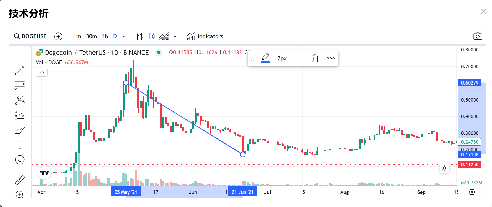
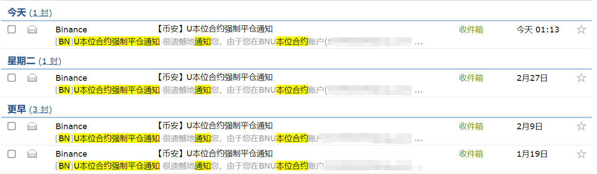
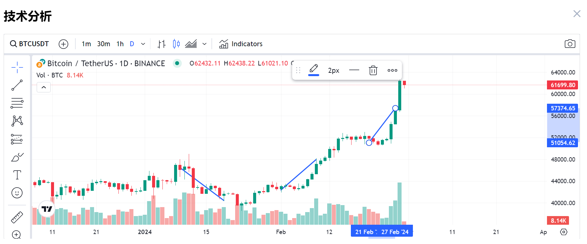
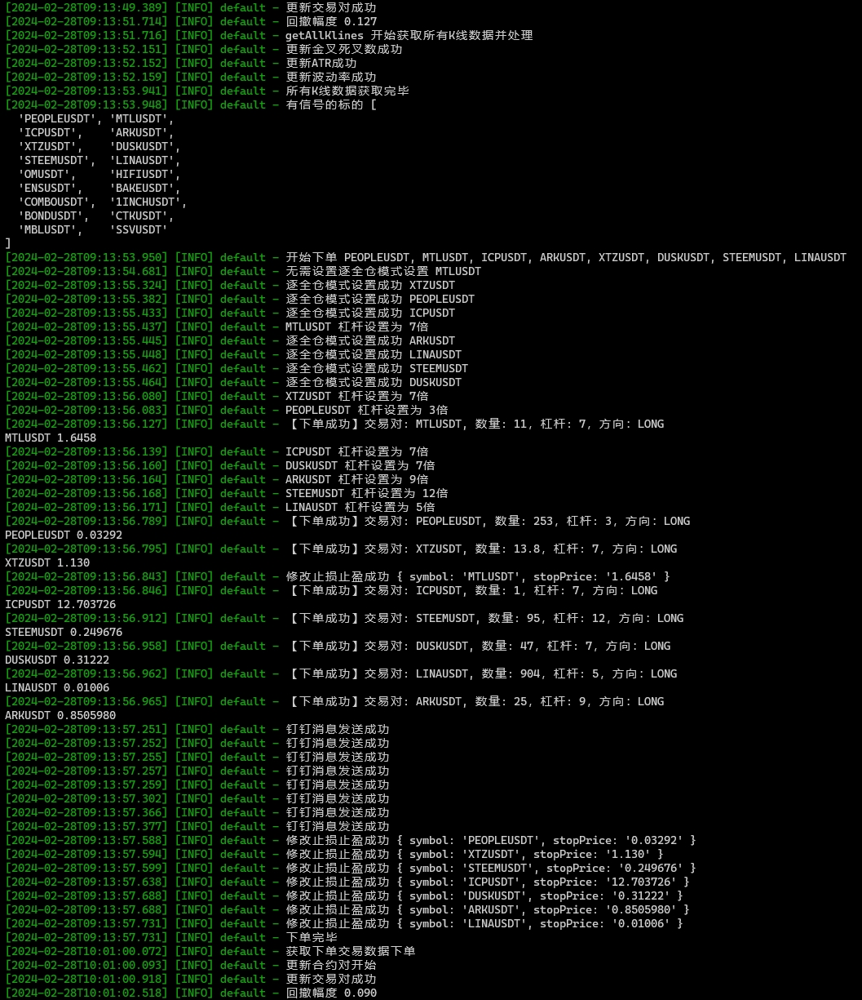
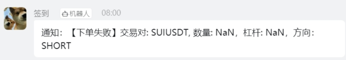
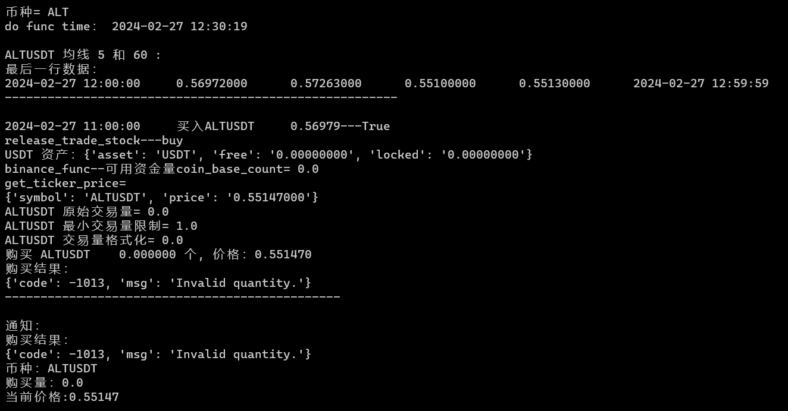
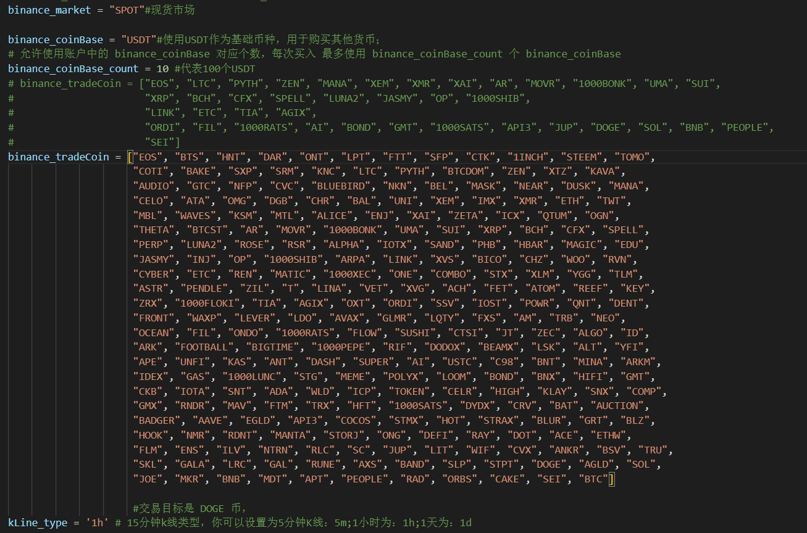
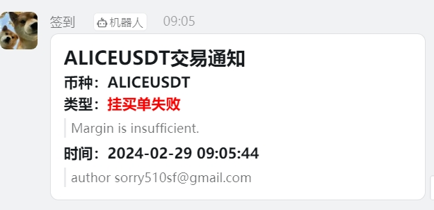
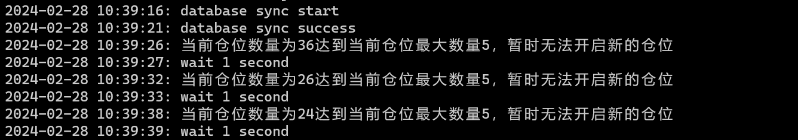

# 炒币日志 - 记录自己的涨跌起伏直至爆仓  

> **2024.2.29**

> 2024.2.29

## 前言

这篇文章记录了我从炒币到爆仓的全过程，从开始的小心谨慎，到后来的每天盯盘，再到睡前最后一次刷新那些数字和睡梦中惊醒，从对每一笔小额收益的满足逐渐转变成对数字市场波动刺激的沉迷，直到我忽视风险，贪婪至爆仓。回首那段狂风暴雨的炒币到爆仓之旅，我深刻意识到，我曾是那个撞了南墙才回头的人。这篇文章，也是我写给自己的一份警示。

加密货币市场既充满诱惑也充满风险，如果能回到过去，或许我会对过去的自己说：“兄弟，等会等会，你这是要上天台的节奏。”

## 初识数字货币

我接触数字货币的时间还是比较早的，大学专业是信息安全，介绍勒索病毒中提到过利用数字货币的匿名性来支付赎金或者利用数字货币进行暗网交易、洗黑钱等。工作后，在某市的网络监控和应急处置中心驻场，对于网络攻击、舆情分析、网络安全应急接触更多了，2017年5月12日，WannaCry勒索病毒爆发，比特币作为赎金支付的方式更深入人心。那时候作为安服仔没日没夜的应急应该刻骨铭心吧，断网打补丁、关smb、封端口、全流量监控分析，

为了交易加密货币，我研究了大量的资料，学习K线图、分析市场趋势，并了解了一些量化交易策略，如双均线金叉死叉、网格交易、海龟交易、趋势追踪、以及使用ATR、MACD、支撑阻力位等技术分析工具。但随着时间的推移，我逐渐丧失了初衷，贪婪和冒险心态让我最终迎来了爆仓的命运，归根到底就是一个字：**贪**。

## 交易历程回顾

- **18年正式接触炒币**

我下载了火币交易所，买了5000块钱的比特币现货，赚了几百块钱就提出来，因为我觉得风险极大，玩了几天就不再玩了。

- **21年大牛市**

各种炒币自由的消息铺天盖地，我也看上了DOGE，加上蹭马斯克的热度，社交媒体上哪都是“到月球”的呐喊声，上车了，社区共识加上信仰DOGE能上1U，从最开始小仓位小仓位的购买，到接触合约。当时的市场是牛市，简直是只要你敢买，就有收获。在几次小赢利的诱惑下，我慢慢放大了自己的投资规模，俗话说得好，“得寸进尺”。我开始离不开每天盯着那几个数字的快感，就像是赌徒看着那转动的轮盘，心跳得比谁都快。在杠杆的驱使下变得贪婪，不断的加仓，试图用更多的杠杆去翻倍我手上的“财富”。运气似乎还在眷顾着我，在0.6U的时候开始做多，最高涨到0.74U，账户金额也多了个0，然后就是大暴跌，在一次插针的时候，保证金迅速被耗尽，我的账户被平仓，而我还来不及做出任何反应，账户清0，离场。

那种从云端跌落谷底的感觉，我这辈子都不想再体验第二次。

- **24年**

在听朋友说买铭文STAS赚钱了后，我的贪婪再次被点燃，人啊，总是容易被眼前的诱惑迷了眼，最终，我没能管住自己的手，重新下载了交易软件，开始观察市场，啥是铭文，了解后学习了很多概念，各个板块，如ai、预言机、二层网络、存储、元宇宙、隐私保护、defi等等一堆，每个板块都买入了几个看起来前景不错的币种。

而随后的各个重要时间点，我都经历了起伏和过山车式的情绪波动，数次账户清空。每一次的失败都让我心痛不已，我不想再有第二次。

  - 1.9号

  山寨币庄家控盘太空易，直接买BTC和ETH，都说现在是大牛市，比特币减半，加上美国证监会史上首次批准比特币现货ETF，妥妥大利好消息，开始做多，然后就一路下跌，没有涨过，这么利好的消息，不涨，一直扛到19号爆仓

  

  - 2.9号

  继续刚大盘，比特币涨了42000左右，横盘了几天，且卖压较大，冲刺了三四次都没上去，感觉要回调，做一波短空，然后横盘了十来天，就一路涨到52000，没有回头，在大年三十晚上8点左右爆仓，价格46000左右吧

  

  - 2.27号

  除夕晚上爆仓后就不在关注大盘了，开始研究山寨币，币安上面各个板块都买了一些币，1%仓位，8倍合约，最多同时开了60个仓位，在大牛市的行情下，大部分币都翻倍盈利，感觉人工太累了，就开始找了些量化程序做自动化交易，在牛市的加持下，程序的结果都是盈利的，当然时间太短了，最长的一个才运行6天，而且是牛市，山寨币大多都上涨了，不具备参考价值，而且代码中我调整了很多，也修改优化了部分策略。

  这几天在手工+程序+牛市的加持下，账户资金已经翻倍了，回来看看大饼，横盘了8天，第九天有下跌的趋势，**果断开空**，结果在26晚上，突然拉升7000点，到56000，插针57400，刚好是我爆仓价格。

  27号去广场闲逛，传遍了一个利好消息和一张没有时间的截图，股神巴菲特认可并购买比特币，我去搜索了一下，发现图片的内容是23年的新闻是一个字都不差，看了下这个新闻，大概意思就是巴菲特花了5亿美金投资了某银行，这个银行支持数字货币交易。。。

  

  - 2.28号

  今天56000又是震荡了一天，想着牛市也没有这么猛吧，一点不回调就上去了，**继续开空**，64000爆仓，设置60000点止损，然后又把止损取消了，自信，晚上确实有一次从61000插针到58000，放心的睡觉了，后半夜惊醒，一看手机爆仓了，最后的希望没有了，卸载APP

  

## 开源量化程序-仅供参考
  
  **大牛市行情，山寨币普遍大涨，每个程序我都进行了一定的修改和适应性调整，程序运行时间太短了，不具备参考价值**

  - [币安海龟交易法量化交易系统](https://github.com/shiki2014/binan)

  海龟交易法是一种基于趋势跟踪的交易策略，常用于股票和期货市场。在加密货币市场中同样适用，其核心思想是追随市场趋势进行交易，同时控制风险和资金管理。本系统通过使用海龟交易法来进行加密货币的交易，旨在获得稳定的收益率。
  
  程序运行截图，产生信号并下单成功

  

  下单失败也发送钉钉消息，如果及时看到会手动开仓

  

  > 评论： 牛市加持下确实稳定盈利，但收益较小

  修改代码
  1. 周期修改为1h，产生更多的交易信号，除了在config.js中修改，还要在services中修改，一共3处，也要在timingController中修改计划任务。
  2. 添加了钉钉通知，改动binanceContractService.js，添加函数sendDingTalkNotification()，并优化了消息通知，下单成功和失败都会通知到钉钉，主要是和手动开仓或其他程序开仓重复就会下单失败

  - [双均线量化交易机器人](https://github.com/luoyanbei/binance-quant-robot)

  双均线策略，以ETH为例，5分钟K线数据，均线5和均线60为例：均线5上穿均线60是金叉，执行买入；均线5下穿均线60是死叉，执行卖出

  程序运行结果

  

  ]
  
  > 评论： 程序只能买现货，从来不买现货，直接发送到钉钉通知，手动开仓

  修改代码
  1. 优化了多币种交易，已提交PR，我把币安上面全部开放合约的交易对都添加上了
  2. 优化了钉钉消息通知
  3. k线我修改成1h

  - [币安合约自动交易系统](https://github.com/sorry510/binance_futures)

  币安合约自动交易，代码中包含6中选币策略和7中交易策略，交易策略看 strategy 目录源码

  程序日志刷新太多，没有啥参考的信息，昨天晚上爆仓了，加上早上清空了钉钉消息，程序关闭前触发了一个下单的信号，币安已经没有保证金下单失败

  

  > 评论： 这个程序是我遇见过不需要修改任何东西就能稳定运行的一个程序，最大仓位10U，15倍合约，默认的选币策略和交易策略，看策略大概是根据最近交易和涨幅来选币，利用移动平均线的转折点作为作为买入卖出信号，运行几个小时赚了2U

  第三套代码是最省心的，但是我第一次运行就踩个大雷，只修改止盈止损率，没有主要到excludeSymbols和maxCount配置，导致把另一套程序开仓和手动仓的单子关了大半，包含eth的一个大单，发现后立马重新开单，损失上百U手续费

  刚开始看这个日志还有点疑惑，一刷币安，我草，咋还剩20个仓位了，立马终止程序，想着自己修改代码判断一下我自己的仓位，发现配置中已经存在这个功能了
  
  

## 贪贪贪贪贪贪贪贪贪贪贪贪贪贪贪贪贪贪

为什么还不回调，很多人觉得三四万的BTC觉得贵，希望在更低的价格上车，那庄家可能把价格推到一个极高的点，在进行小幅回调，到时候五六万的BTC大家就不觉得贵了，纷纷上车，我有个预感今天的价格应该是近期的最高点了，我是死在黎明前的最后一分钟。未来，我不打算再纠结，要控制自己远离投机炒币。

我还有一种预感，庄家可能通过这次牛市或者下次牛市拉高离场，毕竟BTC的车太重了，庄家一走，韭菜就没有能力维持或推动价格继续上涨。庄家或者美国政府出来再发一些利空的消息，比如底层技术或者核心算法存在漏洞、量子计算取得重大突破、安全风险等等，转移到下一个赛道继续割韭菜。
